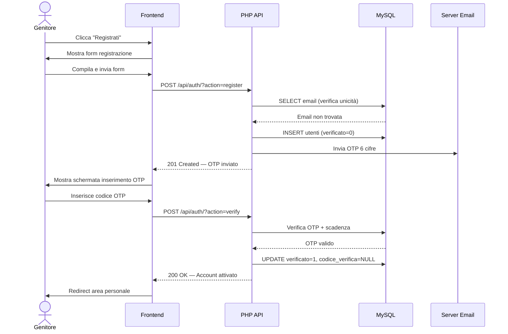
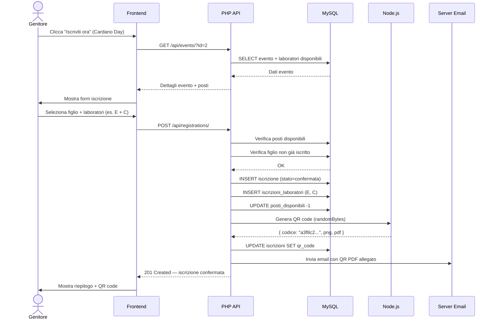
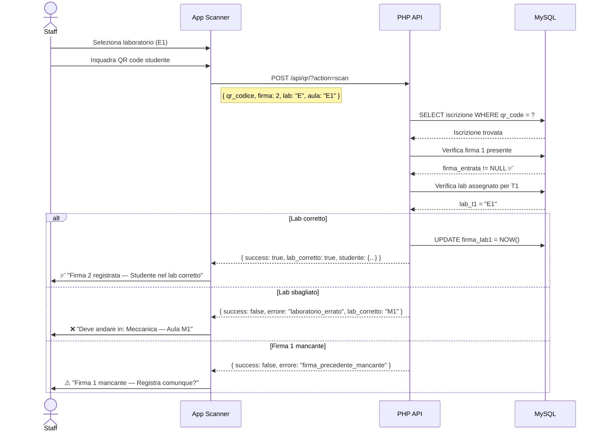
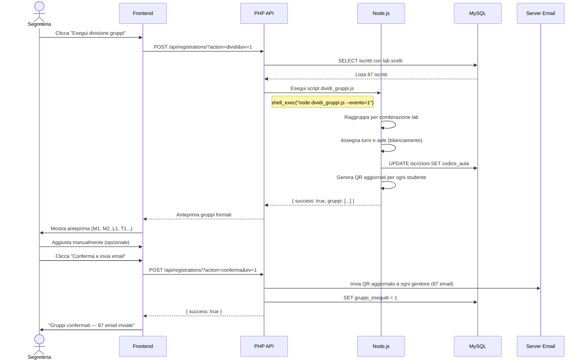
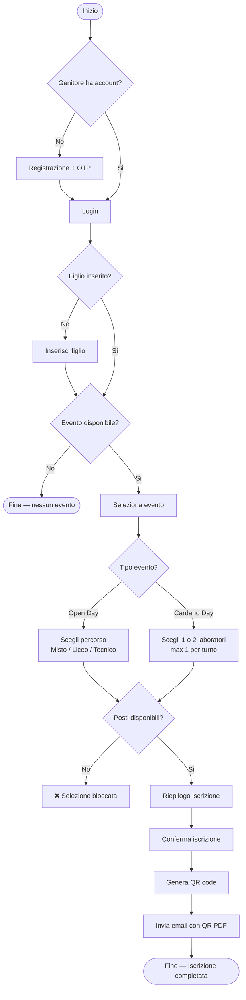
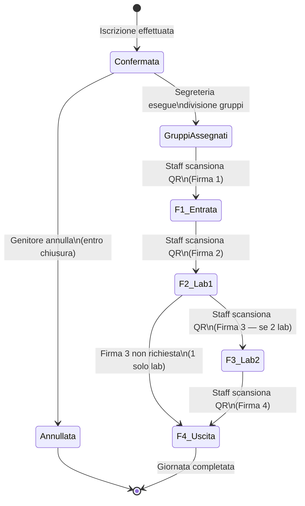

# UML — Diagrammi del Sistema Cardano Day

Tutti i diagrammi sono scritti in sintassi **Mermaid** e possono essere visualizzati su [mermaid.live](https://mermaid.live) oppure in qualsiasi editor che supporti Mermaid (GitHub, GitLab, Notion, Obsidian, ecc.).

---

## UML 1 — Diagramma Use Case

Mostra gli attori e le funzionalità accessibili a ciascun ruolo.

```mermaid
graph TD
    subgraph Attori
        G([👤 Genitore])
        S([🏫 Staff / Professore])
        SEG([📋 Segreteria])
        ADM([👑 Admin])
    end

    subgraph Sistema Cardano Day
        UC1[Registrarsi]
        UC2[Login]
        UC3[Inserire figlio]
        UC4[Iscrivere figlio a evento]
        UC5[Scegliere percorso Open Day]
        UC6[Scegliere laboratori Cardano Day]
        UC7[Scaricare QR code]
        UC8[Annullare iscrizione]

        UC9[Scansionare QR code]
        UC10[Registrare firma 1 - Entrata]
        UC11[Registrare firma 2 - Lab T1]
        UC12[Registrare firma 3 - Lab T2]
        UC13[Registrare firma 4 - Uscita]
        UC14[Visualizzare elenco studenti]

        UC15[Creare evento]
        UC16[Configurare laboratori e turni]
        UC17[Approvare Staff/Professori]
        UC18[Eseguire divisione gruppi]
        UC19[Spostare studenti tra gruppi]
        UC20[Esportare Excel]
        UC21[Inviare email/notifiche]
        UC22[Gestire utenti]

        UC23[Visualizzare dashboard sola lettura]
        UC24[Assegnare ruolo Segreteria]
        UC25[Revocare ruolo Segreteria]
    end

    G --> UC1
    G --> UC2
    G --> UC3
    G --> UC4
    UC4 --> UC5
    UC4 --> UC6
    G --> UC7
    G --> UC8

    S --> UC2
    S --> UC9
    UC9 --> UC10
    UC9 --> UC11
    UC9 --> UC12
    UC9 --> UC13
    S --> UC14

    SEG --> UC2
    SEG --> UC15
    SEG --> UC16
    SEG --> UC17
    SEG --> UC18
    UC18 --> UC19
    SEG --> UC20
    SEG --> UC21
    SEG --> UC22
    SEG --> UC14

    ADM --> UC2
    ADM --> UC23
    ADM --> UC24
    ADM --> UC25
```



---

## UML 2 — Diagramma di Sequenza: Registrazione Genitore



---

## UML 3 — Diagramma di Sequenza: Iscrizione Cardano Day



---

## UML 4 — Diagramma di Sequenza: Scansione QR (Firma 2)



---

## UML 5 — Diagramma di Sequenza: Divisione Gruppi



---

## UML 6 — Diagramma di Attività: Flusso Iscrizione



---

## UML 7 — Diagramma dei Componenti

```mermaid
graph TB
    subgraph Client
        FE_PUB[Frontend Pubblico\nHTML/CSS/JS]
        FE_STAFF[Frontend Staff\nHTML/CSS/JS]
        FE_SEG[Frontend Segreteria\nHTML/CSS/JS]
        FE_ADM[Frontend Admin\nHTML/CSS/JS]
        SCANNER[Scanner QR\nCamera API]
    end

    subgraph Backend PHP
        API_AUTH[/api/auth/\nAutenticazione]
        API_EV[/api/events/\nEventi]
        API_REG[/api/registrations/\nIscrizioni]
        API_QR[/api/qr/\nScanner Firme]
        API_USR[/api/users/\nUtenti]
        API_ADM[/api/admin/\nAdmin]
        JWT_MW[JWT Middleware\nAuthn/Authz]
    end

    subgraph Processi
        NODE_QR[Node.js\nGenerazione QR]
        NODE_GRP[Node.js\nDivisione Gruppi]
        NODE_STAT[Node.js\nStatistiche]
        SMTP[SMTP\nInvio Email]
    end

    subgraph Persistenza
        DB[(MySQL 8+\nDatabase)]
        FILES[File System\nQR PNG/PDF]
    end

    FE_PUB --> API_AUTH
    FE_PUB --> API_EV
    FE_PUB --> API_REG
    FE_STAFF --> API_QR
    FE_STAFF --> API_USR
    FE_SEG --> API_EV
    FE_SEG --> API_REG
    FE_SEG --> API_USR
    FE_ADM --> API_ADM
    SCANNER --> API_QR

    API_AUTH --> JWT_MW
    API_EV --> JWT_MW
    API_REG --> JWT_MW
    API_QR --> JWT_MW
    API_USR --> JWT_MW
    API_ADM --> JWT_MW

    JWT_MW --> DB
    API_REG --> NODE_QR
    API_REG --> NODE_GRP
    API_ADM --> NODE_STAT
    NODE_QR --> FILES
    NODE_QR --> SMTP
    NODE_GRP --> DB
    NODE_GRP --> SMTP
```

---

## UML 8 — Macchina a Stati: Iscrizione



---

*Sezione precedente: [15 — Flusso Completo](../15_flusso/15_flusso.md) | Sezione successiva: [ER Database](../er/er_database.md)*
